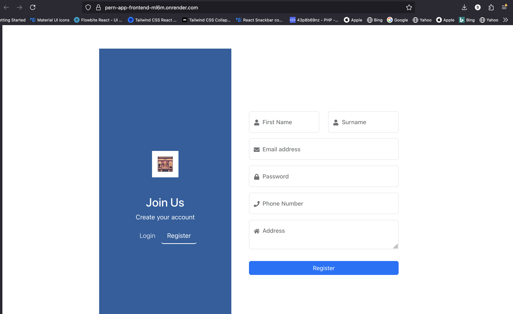
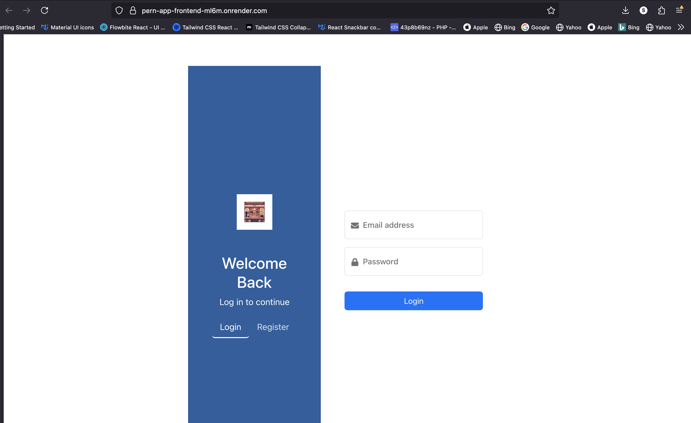
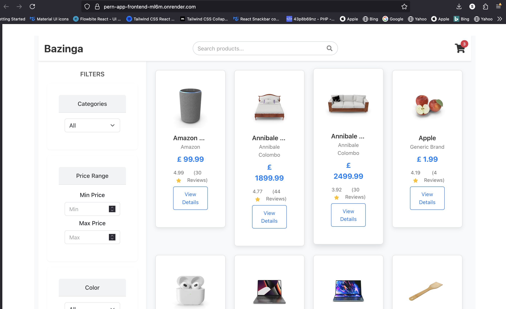
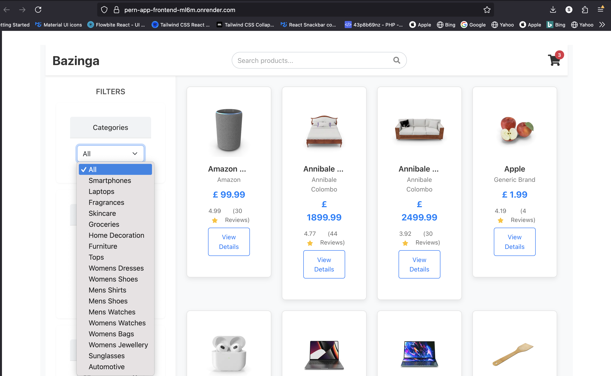
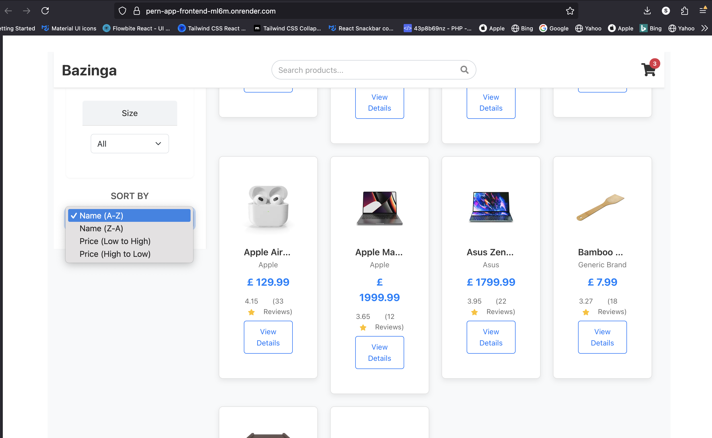

# E-Commerce PERN Stack Application

---

## Table of Contents

* [Introduction](#introduction)
* [Features](#features)
* [Technologies Used](#technologies-used)
* [Project Structure](#project-structure)

---

## Introduction

This project is a robust and scalable e-commerce web application built using the **PERN stack** (PostgreSQL, Express.js, React, Node.js). It's designed to showcase a modern approach to online retail, featuring dynamic product listings, efficient search/filter/sort capabilities, and secure user authentication. The application uses a dummy JSON API for populating product data, making it easy to get started and demonstrate core functionalities without complex external integrations for product sourcing.

---

## Features

* **Product Listing:** Browse a wide range of products fetched from a dummy JSON API.
* **Search Functionality:** Quickly find products using keywords.
* **Filtering Options:** Refine product results based on various criteria (e.g., category, price range).
* **Sorting Capabilities:** Order products by price (low to high, high to low), alphabetical order, etc.
* **Secure User Authentication:**
    * **Signup:** Register new user accounts securely.
    * **Login/Logout:** Authenticate users with Passport.js.
    * **Persistent Sessions:** Maintain user login status across browser sessions.
* **PostgreSQL Database:**
    * Stores user registration data securely.
    * Manages user sessions.
* **Responsive Design:** A user-friendly interface that adapts to various screen sizes (though specific responsiveness might depend on the level of frontend styling implemented).
* **RESTful API:** A clean and well-structured API for seamless communication between the frontend and backend.

---

## Technologies Used

This project leverages the power of the PERN stack, along with several key libraries and tools:

**Backend (Node.js & Express.js):**

* **Node.js:** JavaScript runtime environment.
* **Express.js:** Fast, unopinionated, minimalist web framework for Node.js.
* **PostgreSQL:** Powerful, open-source relational database system.
* **`pg`:** Node.js client for PostgreSQL.
* **Passport.js:** Authentication middleware for Node.js.
    * `passport-local`: Strategy for username and password authentication.
    * `express-session`: Middleware for managing sessions.
    * `connect-pg-simple`: Session store for PostgreSQL.
* **Bcrypt.js:** Library for hashing passwords securely.
* **CORS:** Middleware for enabling Cross-Origin Resource Sharing.
* **`dotenv`:** To load environment variables from a `.env` file.
* **Node-Fetch:** For making HTTP requests to the dummy JSON API (if `axios` is not used).

**Frontend (React):**

* **React.js:** A JavaScript library for building user interfaces.
* **React Router DOM:** For declarative routing in React applications.
* **Axios:** Promise-based HTTP client for the browser and node.js.
* **Tailwind CSS / CSS Modules / Styled Components (Choose one or specify as applicable):** For styling the user interface.
* **Dummy JSON API:** Used for fetching product data (e.g., `https://dummyjson.com/products`).

---

## Project Structure

The repository is typically organized into two main parts: `client` (for the React frontend) and `server` (for the Node.js/Express.js backend).

